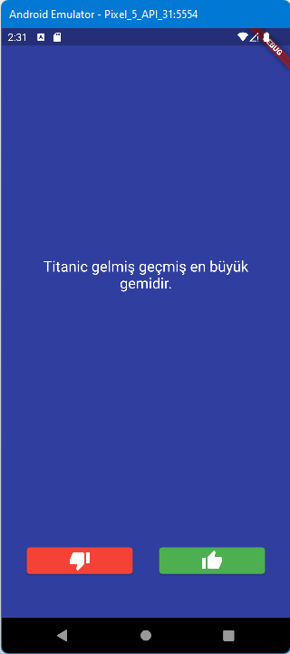
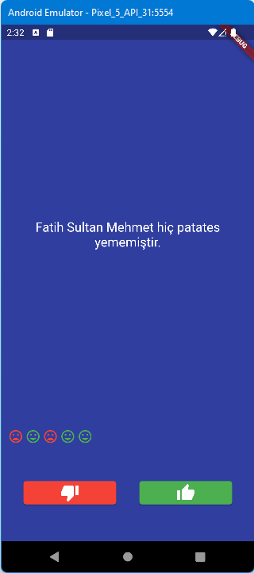
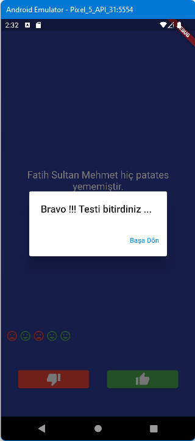

# Bilgi Testi Uygulaması

[https://www.udemy.com/course/flutter-kodplanet/learn/lecture]()
Adresindeki eğitimin,
**bilgiTesti** uygulamasının **Class** yapısına dönüştürülmüş halidir.\
**Abstraction** ve **Encapsulation** uygulanarak kod anlaşılır parçalara
bölünüp daha güvenli hale getirildi. son olarak test bitiminde dialog
kutusu ile başa dönülüyor.\

\