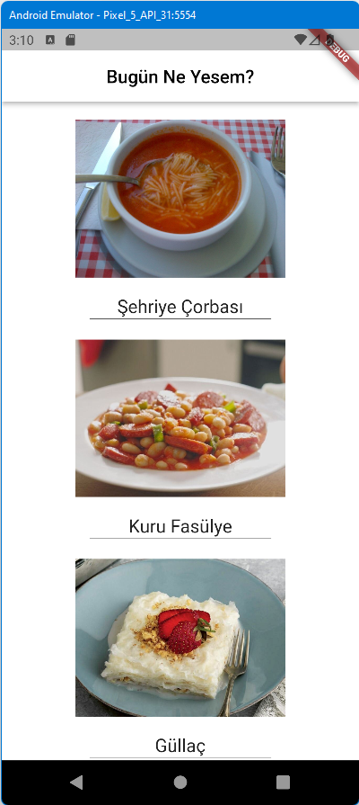
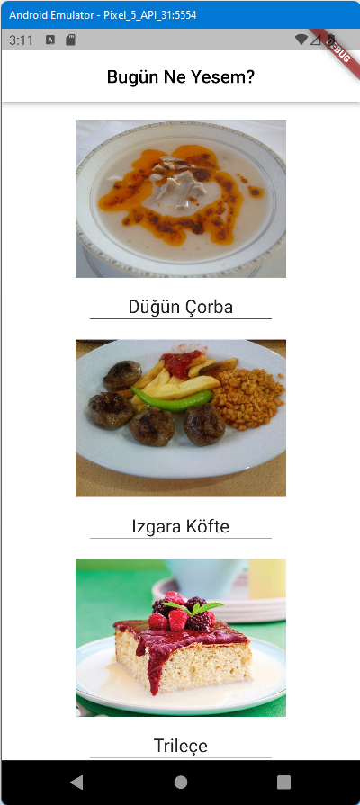

# bugun_ne_yesem

https://www.udemy.com/course/flutter-kodplanet/learn/lecture Eğitimindeki uygulamalardandır.
Bu uygulamadanın ana sayfasında çorba, yemek ve tatlı resimlerinden oluşan üç buton var.
Butonlara tıklandıkça yemek resimleri değişiyor. Toplam olarak 15 resim lokalden çağırılıyor.\
Yemek isimlerini de yazdırıp, yemek butonlarını çizgi ile ayıralım.\
burada kodu kısaltacak yöntemler uygulanmadı.\

\

  