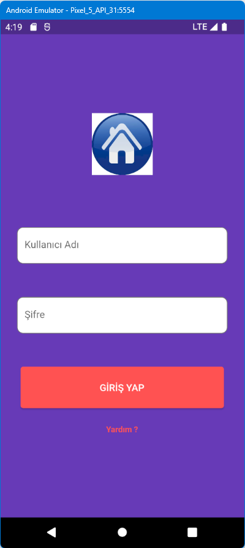

# login_app

Ekran boyutlarına göre otomatik ekran boyutlandırma https://www.udemy.com/course/flutter-ile-uygulama-gelistirme-kursu-android-ios eğitiminden bir örnektir.
\
Burada Arayüz tasarımı, ekran kontrolü \
Bazı Widget 'lar\
* SingleChildScrollview
* Center
* Text
* Column
* Padding
* TextField
* InputDecoration
* SizedBox
* Color
* ElevatedButton
* TextStyle
* GestureDetector