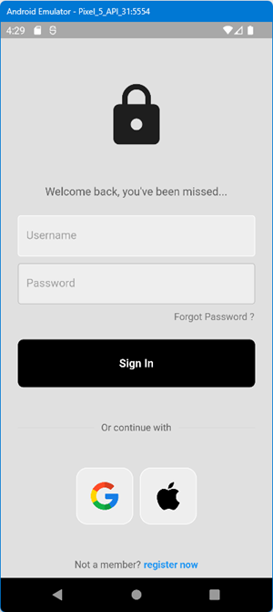
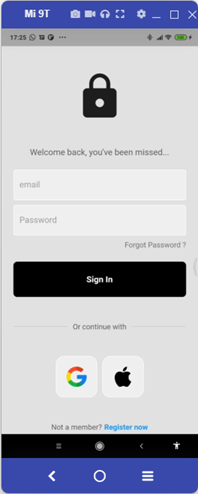
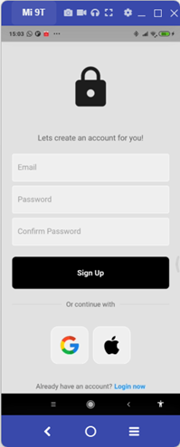
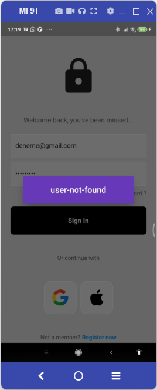
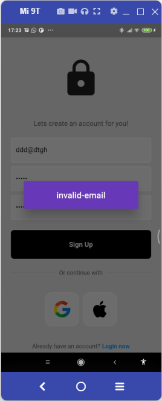
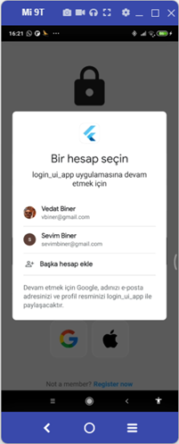
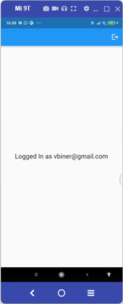

# login_ui_app

Burada takip ettiğim kanallardan birinden dört videoluk eğitim setinin kodları
var. Kodları kendim öğrenme amacı ile kodladım.
https://www.youtube.com/playlist?list=PLlvRDpXh1Se4Ceivpg8KrGvzb8BL9BHwo  
https://github.com/mitchkoko/ModernLoginUI/

Görülen bazı sorunlar:
1. Anlatılan Firebase yöntemi ile olmadı. Manual Firebase eklemesi ile oldu.
2. Firebase ile ilgili hata veriyor ? bu hatanın sebebi emülatör kullanımından kaynaklı
Ancak doğrudan tel bağlarsak Vysor yazılımı ile çalışıyor.

Apple Bilgisayarda deneme şansım olmadığı için Apple ile Sign In in kodda yok.

İlk bölümde oluşturduğumuz ara yüz
 

 
Log In ve Register Now arasında geçiş ekranları 

 
Kullanıcı bulunamadı mesajı 
 
Hatalı mail adresi 
 

/

