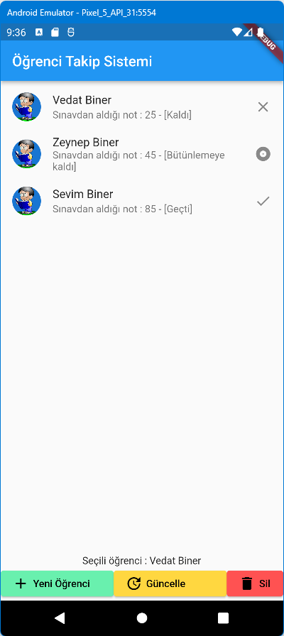
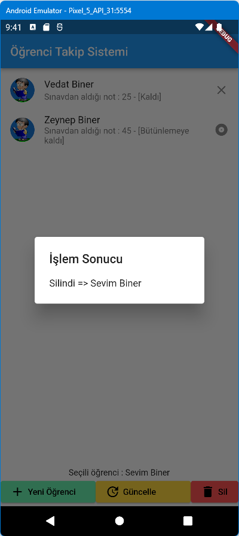

# ogrenci_takip
BTK Akademi Öğrenci Takip Örneği

Eğitim Adresi :
https://www.btkakademi.gov.tr/portal/course/player/deliver/google-flutter-ile-mobil-uygulama-kursu-10150

https://github.com/VedatBiner/Flutter_ogrenci_takip
adresindeki örnekte hatalar var tekrar yapıp, kontrol edeceğim.

4.2 Ders başlangıç
11.1 ile devam 8.00 ile devam
521. sayfadayız

**# flutter_ogrenci_takip**
BTK Akademi flutter Eğitimi

**Öğrenci Takip Projesi** (Hatalar var)
 
* Listview.builder ile dinamik liste alındı.
* Sonuç hesaplama işlemi ve sonuç mesajı ayrı bir fonksiyona çevrildi.
* BuildBody fonksiyonu ile column içinde yer alan liste ve buton ayrı bir widget olarak tanımlandı.
* student.dart dosyası ile models dizini altında bir öğrenci class oluşturuldu.
** Burada öğrencilerin ad soyad ve notları ile geçip kalma durumları ve ikonları görüntülendi.
* leading ile öğrencilere resim eklendi.
* tıklanan öğrencinin ad soyadı konsola yazıldı.
* getter eklenip, sınav sonuçlarının otomatik güncellenmesi yapıldı.
* statelessWidget statefulwidget dönüşümü yapıldı.
* Alt bölüme üç renkli buton eklendi.
* Silme butonu ile silme işlemi yapıldı.
* Ekleme düğmesine navigasyon ile yeni ekrana geçiş eklendi.
* form sayfası ve validasyon kodu düzenlendi.
* Güncelleme kodu eklendi
* Ekleme yapmıyor. Liste güncelenmiyor.
* Güncelleme ve ekleme ile benzer kod kullanıyor, ancak liste güncelenmiyor. Bir öğrenci tıklanırsa o zaman liste güncelleniyor.
 

Başlangıç Görüntüsü   

Silinme mesajı
 

Güncel Liste
 

Hatalı giriş yapılınca validasyon çalışıp hatalarımızı iletiyor.
 

Validation hatası için bir örnek : https://stackoverflow.com/questions/68140451/flutter-form-validation-with-null-safety

RaisedButton yok -> ElevatedButton kullanılır.
ElevatedButton renkleri
style: ElevatedButton.styleFrom(
                  foregroundColor: Colors.black,
                  backgroundColor: Colors.redAccent,
                ),