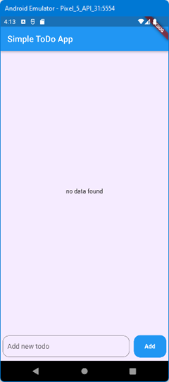
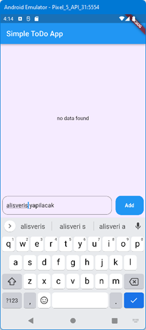
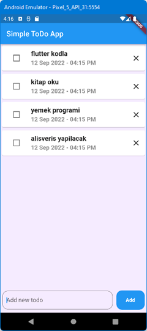

# sqflite_todo_app

[https://www.youtube.com/watch?v=n5tiox4kSWw&ab_channel=SourceCode]() adresindeki örnek
 
Hiç veri girilmemiş ekran görüntüsü\

 
Veri girişi\

 
Listelenmiş veriler. Biten işleri işaretleyebiliyoruz veya silebiliyoruz.\

