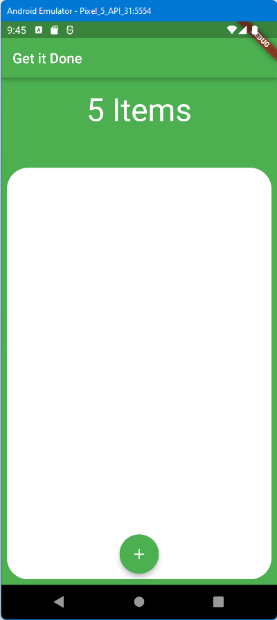
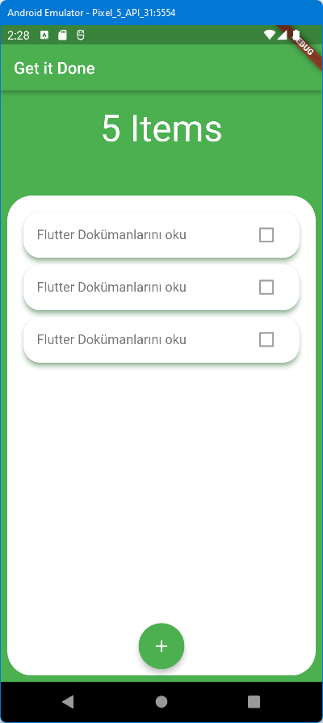
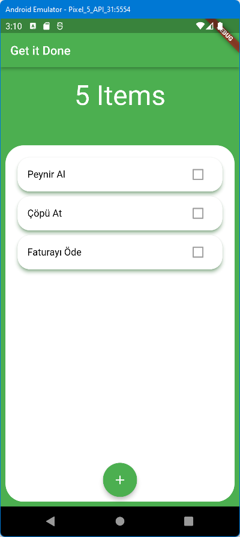
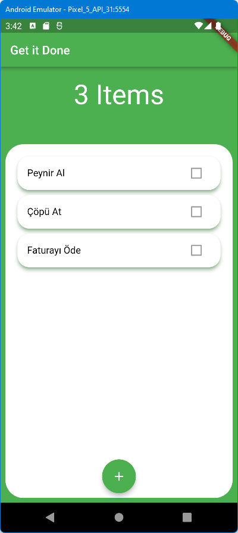
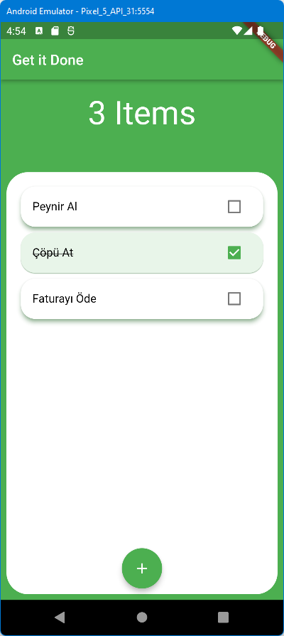
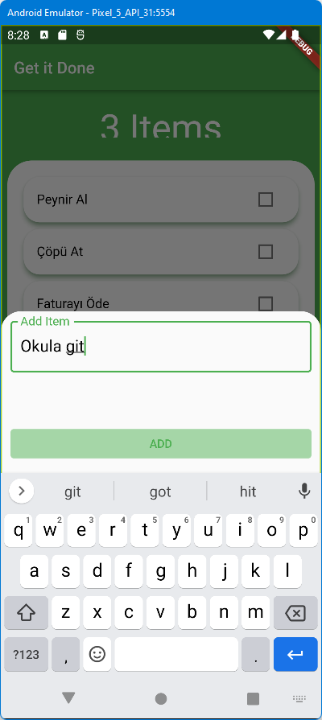
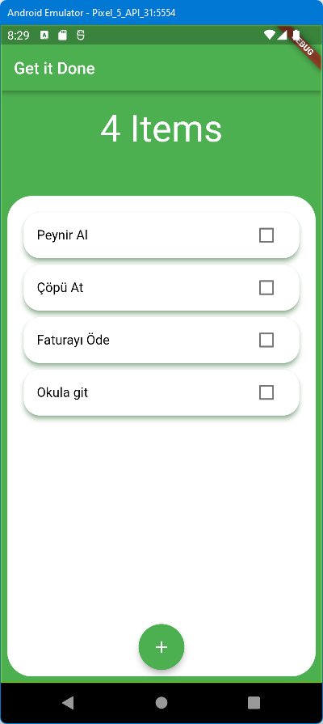

# todolist_app

## Uygulama Teması
Önce Uygulmamızın teması oluşturuluyor.\

Kartlarımız oluştu. (01-Card Branch)\
\
Basit bir veri tabanı görevi görecek liste ile kart maddelerini yazalım. (02-SimpleDB Branch)\
\
**Provider** paketi kullanıp, Sayfa başlığı ve liste eleman sayısının otomatik güncellenmesi sağlandı.\
\
Görev tamamlanınca üzeri çizilsin, buton rengi değişsin, basılı görünümü değişsin\
\
Yeni görev eklenmesi. (05-AddTask Branch)\

