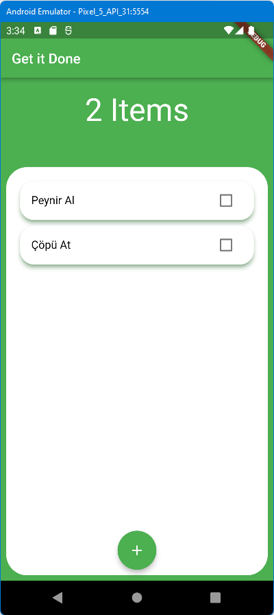
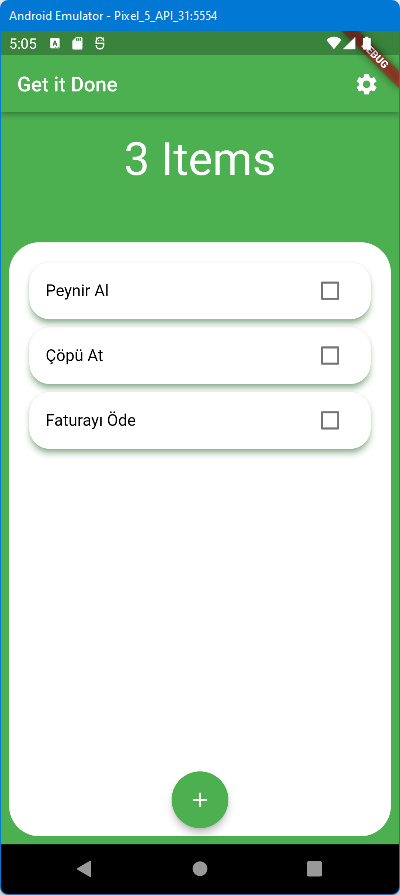

# todolist_app

## Uygulama Teması
Önce Uygulmamızın teması oluşturuluyor.\

Kartlarımız oluştu. (01-Card Branch)\
\
Basit bir veri tabanı görevi görecek liste ile kart maddelerini yazalım. (02-SimpleDB Branch)\
\
**Provider** paketi kullanıp, Sayfa başlığı ve liste eleman sayısının otomatik güncellenmesi sağlandı.\
\
Görev tamamlanınca üzeri çizilsin, buton rengi değişsin, basılı görünümü değişsin\
\
Yeni görev eklenmesi. (05-AddTask Branch)\

\
Seçilen görevin Silinmesi. (06-DeleteTask Branch)\
Seçilen görev parmak veya mouse ile sola çekiliyor.\

\
Renk temasını değiştirmek için bir buton eklendi. (07-Settings Branch)\
Kırmızı yeşil renk değişimi yapıldı. Bu renk değişimi içinde ikinci bir provider kullanıldı. Yani MultiProvider Widget kullanıldı.\

\

\
Refactoring ile bazı düzeltmeler yapıldı. (08-Refactoring Branch)\
Shared Preferences ile en son kullanılan tema bilgisi cihazda tutuldu.
(09-SharedPreferences Branch) 
Örneğin kırmızı tema ile kapatılan uygulama tekrar başlatıldığında yeşil
değil, kırmızı tema ile başladı. 
Listemizi sıfırladık. Uygulama içindeki hazır listeyi iptal ettik. (10-SharedPreferencesList Branch) 
Kendi bilgilerimizi kaydedip çıktık. Uygulamayı tekrar çalıştırınca kaydettiğimz hali ile geldi.  

Birden çok provider yayını için **Provider2** widget kullanıldı. (11-Provider-EkBugFix Branch)
Aynı kayıttan çok kez girildiğinde key bilgisinin tek olması sağlandı. 