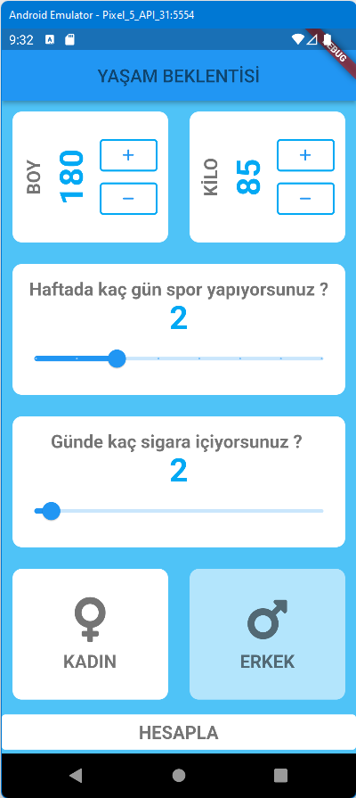

# yasam_beklentisi

https://www.udemy.com/course/flutter-kodplanet/learn/lecture/22340158#overview  
Sayfasındaki eğitimin kodları 

Yaşam Beklentisi örneği. Önce kendi widget 'ımız oluşturuluyor.
Cinsiyet, Spor yapma sıklığı, Sigara kullanım sıklığı,
Boy ve kilo kutuları eklendi. Kendi Widget 'ımızı yaptık,\
GestureDetector, Slider, OutlinedButton Widget kullandık.\
çok sık kullanılan boy kilo işlemleri birbirinin aynı olduğu
için ayrı bir ortak metoda yönlendirerek, kod tekrarından kurtulduk.\
Bu örnekte ama widget buton class navigasyon kullanımını anlatabilmektir.
Kullanılan hesaplama formulü uydurmadır.\

