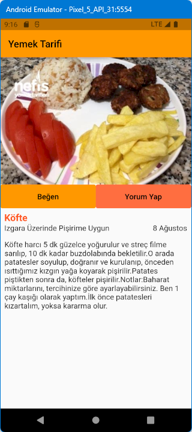

# yemek_tarifi

https://www.udemy.com/course/flutter-ile-uygulama-gelistirme-kursu-android-ios eğitiminden bir örnektir.
Bir yemek tarifi görüntüsü ile,
* Kendi widget 'larımızı kullanma
* Ekran boyutlarına göre otomatik ekran boyutlandırma
* TextButton kullanımı\
\
Burada Arayüz tasarımı, ekran kontrolü yapılıyor\
Bazı Widget 'lar\
* Center
* Column
* Color
* Expanded
* Padding
* SingleChildScrollview
* Spacer
* Text
* TextButton
* TextStyle
